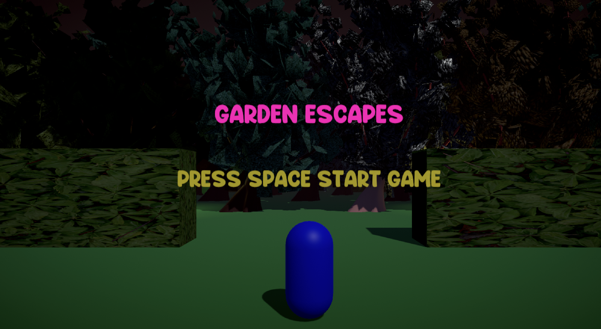
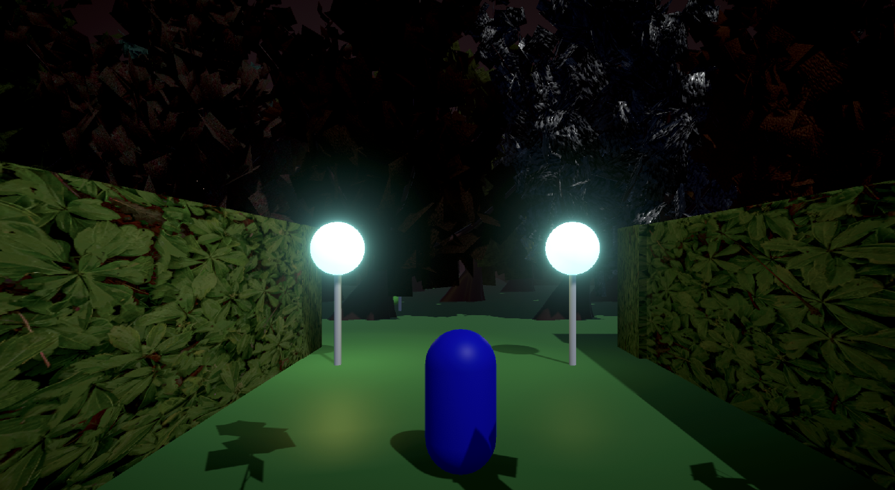
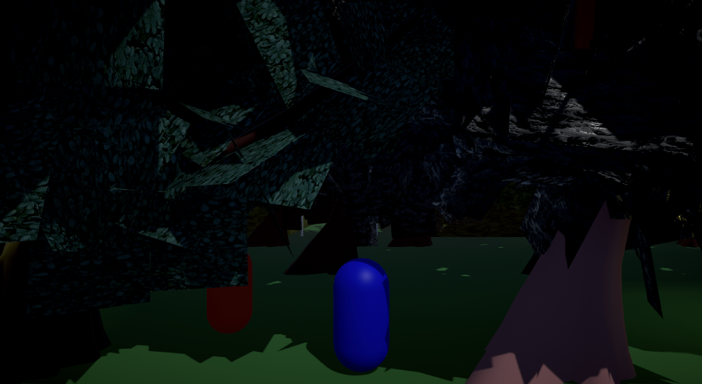
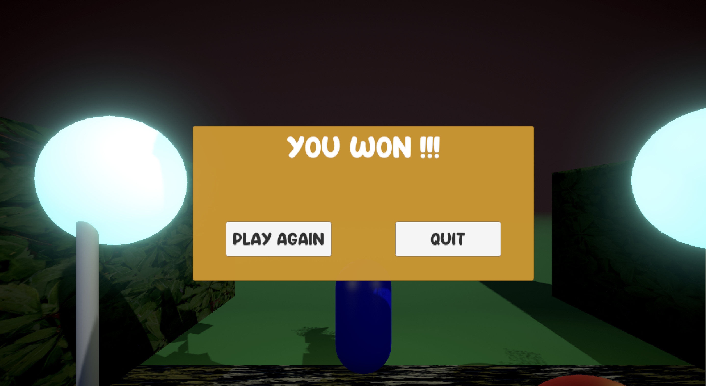

# 🌙 Garden Escapes 👻

A Unity-based **horror survival game** built with **C#**, where you must navigate through a haunted garden, avoid patrolling NPCs, and find the exit.

---

## 🎮 Features

- **Player Movement**
  - Supports both **Old Input System** and **New Input System**.
  - Smooth controls and responsive navigation.

- **Lighting & Atmosphere**
  - Realistic **lamp flicker** using `Mathf.PerlinNoise` + `Mathf.Lerp`.
  - **Night mode** implemented with Unity’s **Post Processing Stack** for a chilling environment.

- **Game World**
  - Designed with **prefabs** for modular and reusable assets.
  - **NPCs** that **patrol** the map and **chase** you if you get too close.

- **Gameplay**
  - **Game Over** and **Game Won** panels for a polished flow.
  - **Background music** for immersive horror vibes.

---

## 🕹️ How to Play

1. Explore the haunted garden.
2. Avoid NPC patrols — if they spot you, **run!**
3. Survive the night to **win**.
4. Get caught → **Game Over**.

---

## 🛠️ Built With

- [Unity Engine](https://unity.com/) (C#)
- **Old & New Input Systems**
- **Post Processing Stack**
- **Mathf.PerlinNoise** and **Mathf.Lerp**
- Prefabs & UI Panels

---

## 📸 Screenshots

|  |  |
|-------------------------------------|----------------------------------------------|
|  |  |

---

## 🚀 Getting Started

### Prerequisites
- Unity (version 6.2 or higher)
- .NET SDK (for C# scripts)

### Installation
```bash
# Clone the repository
git clone https://github.com/blackPie8/ashray_ai_simulation.git

# Open in Unity Hub
